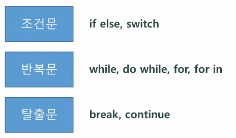

## 🔰 JavaScript란?

웹사이트에 동적인 기능을 넣기 위해 만든 프로그래밍 언어

HTML = 뼈대, CSS = 디자인, JavaScript = 움직임 / 동작

웹 브라우저에서 바로 실행 가능

Node.js, React, Vue.js 등을 통해 백엔드, 앱, 게임 개발 등 다양한 분야에서도 사용됨
---

## 🧠 특징
항목	설명
동적 언어	변수 타입이 유연해서 코드가 짧고 빠르게 작성됨
인터프리터 언어	브라우저가 바로 해석해서 실행함 (컴파일 X)
이벤트 기반	버튼 클릭, 스크롤 등 사용자 행동에 반응
---

## 📚 자바스크립트의 버전

2015년 기준으로 ES5 문법과 ES6 문법으로 나뉨
해마다 새로운 버전이 발표되지만, 큰 변화는 ES5 → ES6 시점에서 일어남
따라서 ES5와 ES6 구분하여 학습하는 것이 중요

---

## ✅ 공부하게 될 내용들

📌 커리큘럼


## ✅ JS 적용 방법


---
## 🖨️ 출력 방법
| 출력 방법 | 사용 함수	| 설명	 | 예시 코드 | 비고 |
|------------| ------------ | ----- | ----------- | -----|
콘솔 출력 |	console.log() | 개발자 도구의 콘솔에 메시지를 출력 | console.log("Hello"); | 디버깅용으로 가장 많이 사용 |
경고창 출력 | alert() | 팝업 알림 창으로 사용자에게 메시지 전달 | alert("Warning!"); | 사용자 인터랙션용 |
HTML 문서에 출력 | document.write() | HTML 문서에 직접 텍스트 출력 | document.write("Hello"); | 학습용, 실무에서는 거의 사용 안 함 |

출력은 위에서 아래 순서대로 실행됨

외부 JS 파일은 <head> 혹은 <body> 태그 맨 마지막에 삽입

삽입 위치에 따라 실행 순서가 달라짐

``` html
<!DOCTYPE html> 
<html> 
<head> 
  <title>Document</title> 
  <script src="ex01.js"></script> 
</head> 
<body> 
  <script> 
    console.log("Hello World!"); // 세미콜론은 선택이지만, 웬만하면 찍는 습관!
  </script>
</body> 
</html>
```


---

## 🆔 식별자(이름 짓는 규칙)

* 대소문자 구분

* 카멜 표기법 사용

* ❌ phone_number

* ✅ phoneNumber

* 띄어쓰기 금지

* 예약어(키워드) 사용 금지

* 상수는 대문자 사용 (const API_KEY = 'abc123')

---

## 📦 변수
자바스크립트의 변수는 데이터를 저장하기 위한 "이름이 붙은 공간"

하나의 값만 저장 가능

선언과 초기화를 통해 사용

값은 언제든 변경 가능

| 키워드 | 특징 |
|------------| ------------ |
| var | ES5 이전부터 사용 / 함수 스코프, 중복 선언 가능 / 호이스팅 발생 (초기화는 X) |
| let | ES6에서 도입 / 블록 스코프, 중복 선언 불가 / TDZ(Temporal Dead Zone) 발생 |
| const | ES6에서 도입 / 블록 스코프 / 재할당 불가 / 객체와 배열 내부 값은 변경 가능 |

---

## 🧾 데이터 타입 (Data Type)

값의 종류나 형태를 나타내는 분류로, 컴퓨터가 값을 어떻게 저장하고 처리할지 결정하는 기준이 됨
기본 데이터 타입

* string – 문자열  
예: "hello", 'JavaScript' (문자들이 연결된 형태)

* number – 숫자  
예: 10, 3.14 (실수, 정수 모두 숫자타입)

* boolean – 불리언  
예: true, false (참,거짓만 저장 가능)

* null – 값이 "없음"

* undefined – 값이 할당되지 않음

* array - 배열  
예: [1,2,3,4], ["홍길동","이순신","유관순"]

* object – 객체 (배열, 함수 포함)  
예: 배열은 대괄호 객체는 {}중괄호다.

---
## ✅ 형변환

**형변환** 은 자바스크립트에서 **값의 데이터 타입을 다른 타입으로 바꾸는 것** 을 말합니다.

예: 숫자를 문자열로, 문자열을 숫자로 바꾸는 등

* 자동 형변환  
```JavaScript
var result = "5" * 2;   // 문자열 "5"가 숫자 5로 바뀜
console.log(result);    // 10

var result2 = "5" + 2;  // 숫자 2가 문자열 "2"로 바뀜
console.log(result2);   // "52"
```

* 명시적 형변환  
```JavaScript
parseInt("10");     // 10
parseFloat("3.14");   // 3.14
"" + 100; //문자열로 변함 
```
---

## ✅ 연산자

####  1. 산술 연산자 +, -, *, /, %, ++, --

```JavaScript
var a = 10;
var b = 3;

console.log("덧셈:", a + b);       // 13
console.log("뺄셈:", a - b);       // 7
console.log("곱셈:", a * b);       // 30
console.log("나눗셈:", a / b);     // 3.333...
console.log("나머지:", a % b);     // 1

a++;
console.log("a 증가 (++):", a);    // 11

b--;
console.log("b 감소 (--):", b);    // 2
```

#### 2. 비교 연산자 ==, ===, !=, !==, <, >, <=, >=, !

```JavaScript
var x = 5;
var y = "5";

console.log("== :", x == y);       // true (값만 비교)
console.log("=== :", x === y);     // false (값 + 타입 비교)
console.log("!= :", x != y);       // false
console.log("!== :", x !== y);     // true
console.log("< :", x < 10);        // true
console.log("> :", x > 10);        // false
console.log("<= :", x <= 5);       // true
console.log(">= :", x >= 6);       // false
```

#### 3. 대입 연산자 =, +=, -=, *=, /=, %= 등

```JavaScript
var score = 10;

score += 5;   // score = score + 5
console.log("+= :", score);       // 15

score -= 3;
console.log("-= :", score);       // 12

score *= 2;
console.log("*= :", score);       // 24

score /= 4;
console.log("/= :", score);       // 6

score %= 4;
console.log("%= :", score);       // 2
```

#### 4. 논리 연산자 &&, ||, !
```JavaScript
var isAdult = true;
var hasID = false;

console.log("AND (&&):", isAdult && hasID); // false
console.log("OR (||):", isAdult || hasID);  // true
console.log("NOT (!):", !isAdult);          // false
```

#### 5. 삼항 연산자 조건 ? 참 : 거짓
```JavaScript
var age = 20;

var result = (age >= 18) ? "성인" : "미성년자";
console.log("삼항 연산자:", result); // 성인
```

**👍연산의 우선순위**

- 각 연산자들은 먼저 계산되는 우선순위가 있습니다.
- 쉽게 생각해서 수학에서 사용하는 형태와 같습니다.

소괄호 > 단항연산자 > 2항연산자 > 3항연산자 > 대입
으로 생각하면 된다.

---

## 입력
자바스크립트에서 **사용자 입력**을 받는 가장 간단한 방법은 **`prompt()`** 함수를 사용하는 것입니다.

.js 파일에서는 사용할 수 없습니다.

html에서만 확인할 수 있어요!

```JavaScript
let name = prompt("당신의 이름은?");
console.log("안녕하세요, " + name + "님!");
```

- prompt()는 사용자에게 입력을 받을 수 있는 입력 창을 띄웁니다.
- 입력된 값은 문자열(string)로 반환 됩니다.
- 입력을 취소하면 null이 반환 됩니다.

---

# 제어문



#### 조건문 if

| 구문 | 설명 |
| ---- | ---- |
| if | 조건이 참이면 코드 블록 실행 |
| else if | 앞의 조건이 거짓이고, 이 조건이 참이면 실행 |
| else | 위 조건들이 모두 거짓이면 실행 |

``` JavaScript
var age = 20;

if (age >= 20) {
  console.log("성인입니다");
} else {
  console.log("어린이입니다");
}
```

``` JavaScript
var age = 20;

if (age >= 20) {
  console.log("성인입니다");
} else if (age >= 13) {
  console.log("청소년입니다");
} else {
  console.log("어린이입니다");
}
```

---

## JavaScript 실습 예제

### 1번 문제

1. -5 ~ 5 사이의 랜덤한 정수를 생성한다.
2. 이 값이 언제든 절대값으로 나오도록 삼항연산식을 세운다.

``` JavaScript
let number = 5;
let result = number - (Math.random() * 11);
console.log(result);

result < 0 ? -result : result;

console.log(parseInt(result));
```

``` PlainText
출력결과
2.0384263615177094
2
```

### 2번 문제

1. 1 ~ 10 사이의 랜덤한 정수를 생성한다.
2. 이 숫자가 3의 배수라면 “3의 배수입니다.”, 아니라면 “3의 배수가 아닙니다.” 출력하기.

``` JavaScript
let number = parseInt(Math.random() * 10) + 1;
console.log(number);

let result = number % 3 === 0 ? "3의 배수입니다." : "3의 배수가 아닙니다.";
console.log(result);
```

``` PlainText
출력결과
1
3의 배수가 아닙니다.
```

### 3번 문제

1. 사용자에게 바구니의 크기를 입력받는다.
2. 사과의 개수를 입력받는다.
3. 사과의 개수와 필요한 바구니의 개수를 출력해준다.

ex) 바구니 크기 = 10, 사과 개수 = 151, 필요한 바구니 수 = 16개
ex) 바구니 크기 = 10, 사과 개수 =150, 필요한 바구니 수 = 15개

``` HTML
<!DOCTYPE html>
<html lang="en">
<head>
    <meta charset="UTF-8">
    <meta name="viewport" content="width=device-width, initial-scale=1.0">
    <title>Document</title>
</head>
<body>
    <script>
        let basketAmount = prompt("바구니 크기를 입력하세요.");
        let appleAmount = prompt("사과의 개수를 입력하세요.");
        let result = appleAmount % basketAmount >= 1 ? parseInt(appleAmount/basketAmount)+1 : appleAmount/basketAmount;
        
        // let result = appleAmount % basketAmount === 0 ? appleAmount/basketAmount : appleAmount % basketAmount >= 1 ? parseInt(appleAmount/basketAmount)+1 : appleAmount % basketAmount;
				// 중첩 삼항연산자로 품 (비효율적 + 머리아픔)
				document.write("사과 개수 :"+appleAmount+" 바구니 크기 : "+basketAmount+" 필요한 바구니 개수 : "+result);    
    </script>
</body>
</html>
```

### 4번 문제

1. 키를 실수형으로 입력받는다.
2. 나이를 정수형으로 입력받는다.
3. 키가 140 이상이고, 나이가 8세 이상이면 자이로드롭을 탈 수 있다.
4. 둘 중 하나라도 만족하지 못하면 놀이기구를 탈 수 없다.

``` HTML
<!DOCTYPE html>
<html lang="en">
<head>
    <meta charset="UTF-8">
    <meta name="viewport" content="width=device-width, initial-scale=1.0">
    <title>Document</title>
</head>
<body>
    <script>
        let height = parseFloat(prompt("당신의 키를 적어주세요."));
        let age = parseInt(prompt("당신의 나이를 적어주세요."));

        if(height >= 140 && age >= 8) {
            document.write("자이로드롭 탑승 가능합니다.");
        } else {
            document.write("놀이기구 탑승이 불가능합니다.");
        }
    </script>
</body>
</html>
```
``` PlainText
출력결과
height에 140, age에 7을 넣으면 else문 동작
height에 139, age에 8을 넣어도 else문 동작
height에 140, age에 8을 넣으면 if문 동작
height 140이상 age 8이상이면 if문 동작 둘중 하나라도 만족하지 못하면 else문이 동작함.
```
