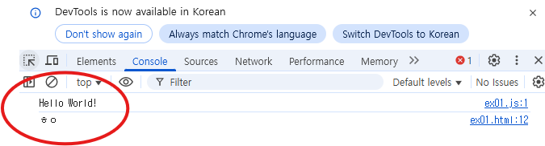

## 🔰 JavaScript란?

웹사이트에 동적인 기능을 넣기 위해 만든 프로그래밍 언어

HTML = 뼈대, CSS = 디자인, JavaScript = 움직임 / 동작

웹 브라우저에서 바로 실행 가능

Node.js, React, Vue.js 등을 통해 백엔드, 앱, 게임 개발 등 다양한 분야에서도 사용됨
---

## 🧠 특징
항목	설명
동적 언어	변수 타입이 유연해서 코드가 짧고 빠르게 작성됨
인터프리터 언어	브라우저가 바로 해석해서 실행함 (컴파일 X)
이벤트 기반	버튼 클릭, 스크롤 등 사용자 행동에 반응
---

## 📚 자바스크립트의 버전

2015년 기준으로 ES5 문법과 ES6 문법으로 나뉨
해마다 새로운 버전이 발표되지만, 큰 변화는 ES5 → ES6 시점에서 일어남
따라서 ES5와 ES6 구분하여 학습하는 것이 중요

---

## ✅ 공부하게 될 내용들

📌 커리큘럼


## ✅ JS 적용 방법


---
## 🖨️ 출력 방법
| 출력 방법 | 사용 함수	| 설명	 | 예시 코드 | 비고 |
|------------| ------------ | ----- | ----------- | -----|
콘솔 출력 |	console.log() | 개발자 도구의 콘솔에 메시지를 출력 | console.log("Hello"); | 디버깅용으로 가장 많이 사용 |
경고창 출력 | alert() | 팝업 알림 창으로 사용자에게 메시지 전달 | alert("Warning!"); | 사용자 인터랙션용 |
HTML 문서에 출력 | document.write() | HTML 문서에 직접 텍스트 출력 | document.write("Hello"); | 학습용, 실무에서는 거의 사용 안 함 |

출력은 위에서 아래 순서대로 실행됨

외부 JS 파일은 <head> 혹은 <body> 태그 맨 마지막에 삽입

삽입 위치에 따라 실행 순서가 달라짐

<pre> ```html 
<!DOCTYPE html> 
<html> 
<head> 
<title>Document</title> 
<script src="ex01.js"></script> 
</head> 
<body> 
<script> console.log("Hello World!"); // 세미콜론은 선택이지만, 웬만하면 찍는 습관! </script>
</body> 
</html> ``` </pre>



## 🆔 식별자(이름 짓는 규칙)

* 대소문자 구분

* 카멜 표기법 사용

* ❌ phone_number

* ✅ phoneNumber

* 띄어쓰기 금지

* 예약어(키워드) 사용 금지

* 상수는 대문자 사용 (const API_KEY = 'abc123')

---

## 📦 변수
자바스크립트의 변수는 데이터를 저장하기 위한 "이름이 붙은 공간"

하나의 값만 저장 가능

선언과 초기화를 통해 사용

값은 언제든 변경 가능

| 키워드 | 특징 |
| var | ES5 이전부터 사용 / 함수 스코프 / 중복 선언 가능 / 호이스팅 발생 (초기화는 X) |
| let | ES6에서 도입 / 블록 스코프 / 중복 선언 불가 / TDZ(Temporal Dead Zone) 발생 |
| const | ES6에서 도입 / 블록 스코프 / 재할당 불가 / 객체와 배열 내부 값은 변경 가능 |

---

## 🧾 데이터 타입 (Data Type)

값의 종류나 형태를 나타내는 분류로, 컴퓨터가 값을 어떻게 저장하고 처리할지 결정하는 기준이 됨

기본 데이터 타입

* string – 문자열  
예: "hello", 'JavaScript'

* number – 숫자  
예: 10, 3.14

* boolean – 불리언  
예: true, false

* null – 값이 "없음"

* undefined – 값이 할당되지 않음

* object – 객체 (배열, 함수 포함)